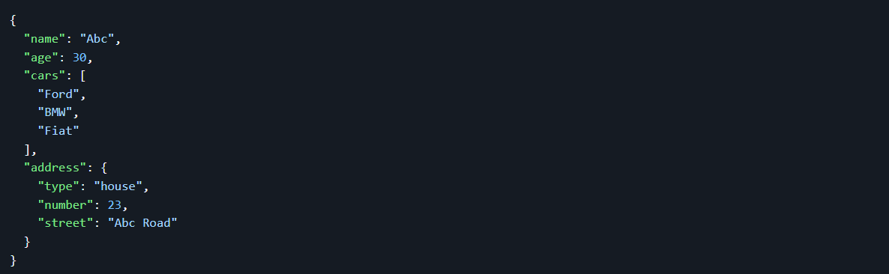
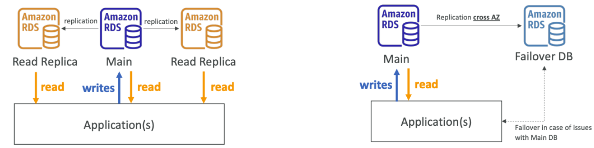
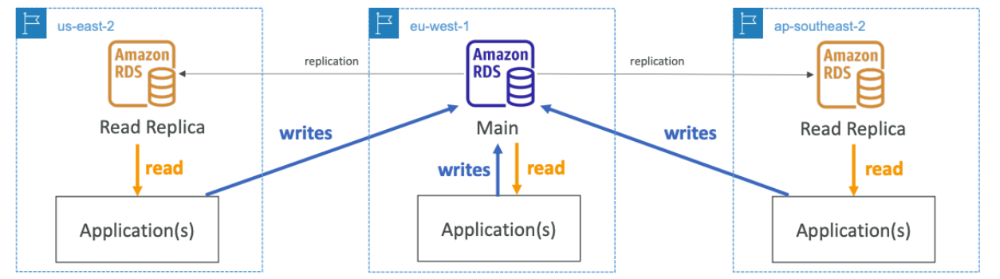

# # AWS Databases & Analytics Overview

## Databases Intro

Storing data on disk (EFS, EBS, EC2 Instance Store, S3) can have its limits.  
Sometimes, you want to store data in a database…

- You can structure the data  
- You build indexes to efficiently query / search through the data  
- You define relationships between your datasets  

Databases are optimized for a purpose and come with different features, shapes, and constraints.

---

## Managed Databases

AWS takes care of maintenance, backups, and security for databases.

**Benefits:**  
- Reduced operational complexity  
- Built-in high availability  
- Disaster recovery  
- Scalability  
- Enhanced security  

---

## Types of Databases

### Relational Databases (SQL)

- **Structured Data:** Stored in predefined schema tables, managed with SQL.  
- **Use Cases:** Transactional applications, financial systems.  
- **Examples:** MySQL, PostgreSQL, Oracle, SQL Server, MariaDB.  

### NoSQL Databases

- **Flexible Schema:** No predefined schema, designed for fast and scalable data storage.  
- **Use Cases:** Real-time applications, IoT, mobile apps.  

**Benefits:**  
- Flexibility: easy to evolve data model  
- Scalability: designed to scale-out by using distributed clusters  
- High-performance: optimized for a specific data model  
- Highly functional: types optimized for the data model  

**Examples:** DynamoDB, MongoDB (DocumentDB), Key-value, document, graph, in-memory, search databases  

---

## NoSQL Data Example: JSON

- JSON is a common form of data that fits into a NoSQL model  
- Data can be nested  
- Fields can change over time  
- Support for new types: arrays, etc…

# Databases & Shared Responsibility on AWS

| **AWS Responsibility**                      | **Customer Responsibility**                        |
|---------------------------------------------|---------------------------------------------------|
| Infrastructure management, backups, patches | Data security, encryption, access controls (IAM)  |
| Availability and failover                    | Data management, monitoring, performance tuning    |

---

## AWS RDS Overview

**RDS (Relational Database Service):**  
Fully managed service for relational databases.  
It’s a managed DB service that uses SQL as a query language.  
Supports MySQL, PostgreSQL, MariaDB, Oracle, SQL Server.  
Handles backup, patching, high availability (Multi-AZ), and scaling.

---

### Advantages of RDS over deploying DB on EC2

RDS is a managed service:  
- Automated provisioning, OS patching  
- Continuous backups and restore to specific timestamp (Point in Time Restore)!  
- Monitoring dashboards  
- Read replicas for improved read performance  
- Multi-AZ setup for DR (Disaster Recovery)  
- Maintenance windows for upgrades  
- Scaling capability (vertical and horizontal)  
- Storage backed by EBS (gp2 or io1)  

**Note:** You cannot SSH into your RDS instances.

---

## RDS Deployments

### Read Replicas
- Improves read performance  
- Asynchronous replication  
- Can create up to 5 Read Replicas  
- Data is only written to the main DB  

### Multi-AZ
- Automatic failover, high availability for production environments  
- Data is only read/written to the main database  
- Can only have 1 other AZ as failover  

### Multi-Region
- Disaster recovery across regions  
- Global availability  

---

## Summary Table: Read Replicas vs Multi-AZ

| **Read Replicas**                 | **Multi-AZ**                                  |
|----------------------------------|-----------------------------------------------|
| Scale the read workload of your DB | Failover in case of AZ outage (high availability) |
| Can create up to 5 Read Replicas | Can only have 1 other AZ as failover            |
| Data is only written to the main DB | Data is only read/written to the main database |

## RDS Deployments: Multi-Region

- Multi-Region (Read Replicas)
- Disaster recovery in case of region issue
- Local performance for global reads
- Replication cost

## Amazon Aurora

- High-performance RDS database  
- Compatible with MySQL and PostgreSQL  
- 5x faster than MySQL, 3x faster than PostgreSQL  
- Auto-scaling storage up to 64 TB  
- Supports Multi-AZ and up to 15 read replicas  
- Great for enterprise-grade applications requiring high availability and performance  
- Costs about 20% more than RDS but is more efficient  

---

## Amazon ElastiCache Overview

- In-memory data caching service  
- **Redis:** Advanced key-value store with replication and persistence  
- **Memcached:** Simple, memory-only caching service  
- Reduces database load and speeds up applications by caching frequent queries  
- Caches are in-memory databases with high performance and low latency  
- AWS handles OS maintenance, patching, optimization, setup, monitoring, failure recovery, and backups  

---

## DynamoDB

- Fully managed, serverless NoSQL database  
- Supports key-value and document data models  
- Automatically scales based on demand  
- High availability and durability with replication across 3 AZ  
- Millions of requests per second, trillions of rows, 100s of TB storage  
- Single-digit millisecond latency, fast and consistent performance  
- Integrated with IAM for security, authorization, and administration  
- Low cost and auto scaling capabilities  

### Additional Features
- **Standard & Infrequent Access (IA) Table Class**  
- **DynamoDB Accelerator (DAX):** In-memory caching, 10x faster reads, microsecond latency  
- **DynamoDB Global Tables:** Multi-region replication for global apps, low-latency multi-region reads/writes, multi-master replication  

---

## Redshift Overview

- Managed data warehousing service  
- Optimized for OLAP and big data analytics  
- Uses columnar storage for fast queries  
- 10x better performance than other warehouses, scales to PBs of data  
- Supports BI tool integrations (QuickSight, Tableau)  
- Massively Parallel Query Execution (MPP), highly available  
- SQL interface for querying  
- Pricing: pay-per-query or reserved instances  

---

## Amazon EMR (Elastic MapReduce)

- Managed big data processing service  
- Uses Hadoop, Apache Spark, Hive for large data sets  
- Ideal for data transformation, ML, ETL  
- Integrates with S3, DynamoDB, Redshift  
- Clusters with hundreds of EC2 instances  
- Auto-scaling and Spot instance integration  

---

## Amazon Athena

- Serverless query service  
- Use SQL to query structured/unstructured data in S3  
- No infrastructure to manage, pay-per-query  
- Supports CSV, JSON, Parquet, ORC formats  
- Pricing: $5.00 per TB scanned  
- Use compressed/columnar data for cost savings  
- Use cases: BI, analytics, VPC Flow Logs, ELB logs, CloudTrail  

---

## Amazon QuickSight

- BI tool for data visualization  
- Serverless, ML-powered dashboards  
- Fast, auto-scalable, embeddable, pay-per-session pricing  
- Supports data from S3, Redshift, RDS, other AWS sources  
- Use cases: business analytics, visualization, ad-hoc analysis  

---

## DocumentDB (with MongoDB Compatibility)

- Managed document database, MongoDB-compatible  
- Highly scalable and durable with Multi-AZ  
- Built for JSON document storage  
- Auto-scales with millions of requests per second  
- Use cases: content management, cataloging, mobile backends  

---

## Amazon Neptune

- Fully managed graph database  
- Optimized for highly connected datasets (social networks, fraud detection, recommendation engines)  
- Highly available across 3 AZ with up to 15 read replicas  
- Stores billions of relationships, millisecond latency queries  

---

## Amazon QLDB

- Quantum Ledger Database (immutable, cryptographically verifiable ledger)  
- Fully managed, serverless, highly available with 3 AZ replication  
- Tracks history of changes to data over time  
- 2-3x better performance than blockchain ledger frameworks  
- Uses SQL for data manipulation  
- Differs from Managed Blockchain by lacking decentralization  

---

## Amazon Managed Blockchain

- Managed service to join or create scalable blockchain networks  
- Supports Hyperledger Fabric & Ethereum frameworks  

---

## AWS Glue

- Managed ETL (Extract, Transform, Load) service  
- Fully serverless  
- Glue Data Catalog integrates with Athena, Redshift, EMR  

---

## DMS - Database Migration Service

- Quickly and securely migrate databases to AWS  
- Source DB remains available during migration  
- Supports homogeneous (e.g., Oracle to Oracle) and heterogeneous migrations (e.g., SQL Server to Aurora)  

---

## Summary: Databases & Analytics Services

| Service                  | Description                                      |
|--------------------------|--------------------------------------------------|
| RDS & Aurora             | Relational databases (OLTP)                      |
| ElastiCache              | In-memory caching                                |
| DynamoDB & DAX           | Serverless key/value and caching                 |
| Redshift                 | Data warehouse (OLAP)                            |
| EMR                      | Hadoop & Spark big data processing               |
| Athena                   | Serverless SQL querying of S3 data               |
| QuickSight               | BI and data visualization                        |
| DocumentDB               | MongoDB-compatible NoSQL document DB             |
| QLDB                     | Immutable ledger database                        |
| Managed Blockchain       | Blockchain service                               |
| Glue                     | ETL and Data Catalog                             |
| DMS                      | Database migration                               |
| Neptune                  | Graph database                                   |
