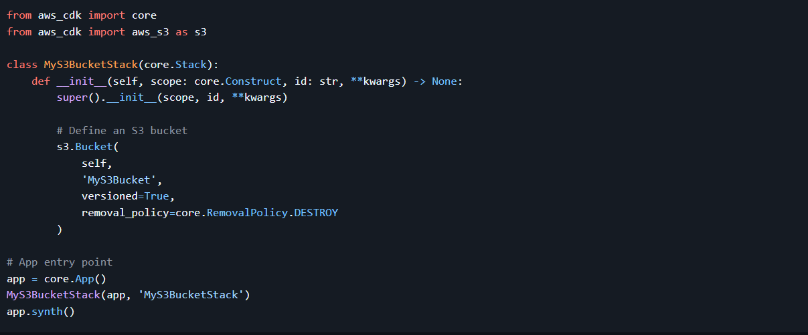
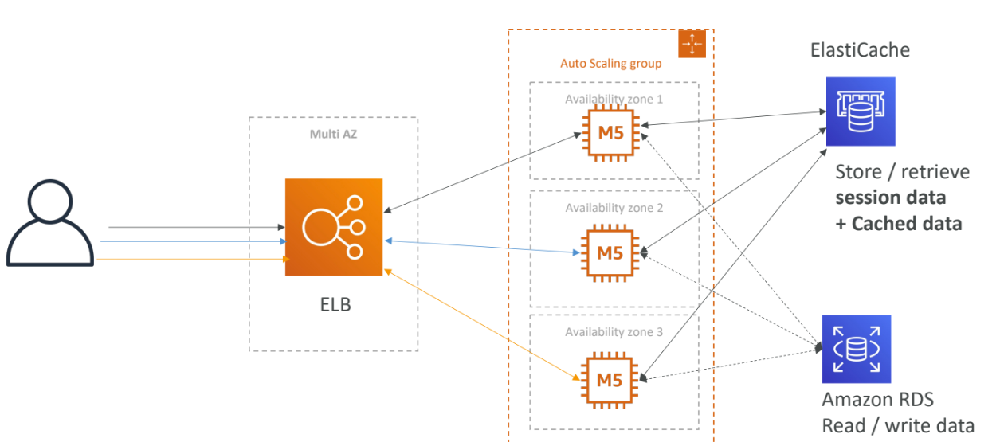
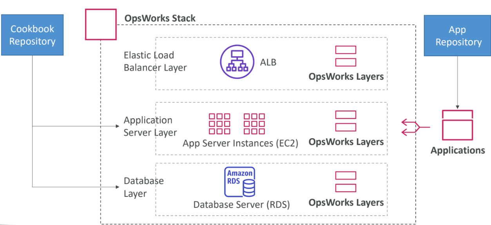

# Deploying and Managing Infrastructure at Scale

## What is CloudFormation?

CloudFormation is a **declarative** way to define your AWS infrastructure for almost any resource.

For example, in a CloudFormation template, you specify:
- I want a security group.
- I want two EC2 instances using this security group.
- I want an S3 bucket.
- I want a load balancer (ELB) in front of these instances.

CloudFormation then creates all these resources **in the right order** with the exact configuration you specify.

---

## Benefits of AWS CloudFormation

### Infrastructure as Code
- No resources are created manually — great for control and consistency.
- Infrastructure changes are reviewed through code, making it safer and auditable.

### Cost Management
- Each resource in a stack is tagged with an identifier, making it easy to track costs.
- You can estimate costs from your CloudFormation template.
- Savings strategy example: In development, automate deleting stacks at 5 PM and recreating them at 8 AM to reduce costs safely.

### Productivity
- Quickly destroy and recreate infrastructure on the cloud as needed.
- Automatic generation of diagrams for your templates.
- Declarative programming means you don’t have to worry about ordering or orchestration.
- Leverage existing templates and AWS documentation — don’t reinvent the wheel!

### Broad Resource Support
- Supports (almost) all AWS resources.
- You can use **custom resources** for anything not natively supported.

---

## CloudFormation Stack Designer

- Visual tool to see all resources in your stack.
- Visualize relationships and dependencies between components.
- Example: WordPress CloudFormation stack showing all interconnected resources.

---

## AWS Cloud Development Kit (CDK)

- Define your cloud infrastructure using familiar programming languages:
  - JavaScript / TypeScript
  - Python
  - Java
  - .NET
- Your code is compiled into a CloudFormation template (JSON/YAML).
- Enables deploying infrastructure and application runtime code together.
- Great for Lambda functions and Docker containers in ECS/EKS.

---

## Example: AWS CDK with Python

To use AWS CDK:

1. Install the CDK CLI and initialize a new CDK project.
2. Define your infrastructure using Python or your preferred language.
3. Deploy your infrastructure using the CDK CLI.

- In below example, we define an AWS CDK stack that creates an S3 bucket with versioning enabled. To run this code, you'll need to have the AWS CDK for Python (aws-cdk-lib) installed in your Python environment. You can install it using pip:

# pip install aws-cdk-lib

- Once you have the dependencies installed, you can execute this Python script, and it will create the S3 bucket in your AWS account based on the code defined in the MyS3BucketStack class.

## Developer problems on AWS

- Managing infrastructure
- Deploying Code
- Configuring all the databases, load balancers, etc
- Scaling concerns
- Most web apps have the same architecture (ALB + ASG)
- All the developers want is for their code to run!
- Possibly, consistently across different applications and environments

## Typical architecture: Web App 3-tierDeveloper problems on AWS

# AWS Elastic Beanstalk Overview

Elastic Beanstalk is a developer-centric way to deploy applications on AWS.

It uses all the components we’ve seen before: EC2, Auto Scaling Groups (ASG), Elastic Load Balancer (ELB), RDS, etc.

But it presents everything in one view that’s easy to make sense of!

We still have full control over the configuration.

**Beanstalk = Platform as a Service (PaaS)**

- Beanstalk is free but you pay for the underlying instances.
- Managed service:
  - Instance configuration / OS is handled by Beanstalk.
  - Deployment strategy is configurable but performed by Elastic Beanstalk.
  - Capacity provisioning.
  - Load balancing & auto-scaling.
  - Application health monitoring & responsiveness.
- Just the application code is the responsibility of the developer.

## Three Architecture Models

- **Single Instance deployment:** good for development.
- **Load Balancer + ASG:** great for production or pre-production web applications.
- **ASG only:** great for non-web apps in production (workers, etc.).

## Support for Many Platforms

- Go
- Java SE
- Java with Tomcat
- .NET on Windows Server with IIS
- Node.js
- PHP
- Python
- Ruby
- Packer Builder
- Single Container Docker
- Multi-Container Docker
- Preconfigured Docker

If not supported, you can write your custom platform.

---

# Elastic Beanstalk vs CloudFormation

AWS Elastic Beanstalk uses AWS CloudFormation underneath to manage infrastructure and resources required to run your application.

| Parameters      | AWS CloudFormation                 | AWS Elastic Beanstalk              |
|-----------------|----------------------------------|----------------------------------|
| Purpose         | Infrastructure as Code            | Platform as a Service             |
| Deployment      | Define and manage AWS infrastructure | Simplified app deployment & scaling |
| Control         | High control and flexibility over underlying resources | Simplified management of underlying resources |
| Management      | Manages entire stack of resources | Abstracts infrastructure management |
| Granularity     | Fine-grained control              | Limited configuration             |
| Configuration   | Uses JSON or YAML templates       | Prescriptive configuration & environment setup |
| Use Cases       | Complex architectures and multi-service | Web app deployment and scaling  |

---

# Elastic Beanstalk - Health Monitoring

- Health agent pushes metrics to CloudWatch.
- Checks app health and publishes health events.

---

# AWS CodeDeploy

- Automate application deployment.
- Works with EC2 instances and on-premises servers.
- Hybrid service.
- Servers/Instances must be provisioned and configured ahead of time with the CodeDeploy Agent.

---

# AWS CodeCommit

Before pushing code to servers, it needs to be stored somewhere. Developers usually store code in repositories using Git technology.

- AWS CodeCommit is AWS's Git-based source control service.
- Makes collaboration easy.
- Code changes are automatically versioned.

**Benefits:**

- Fully managed
- Scalable & highly available
- Private, secured, integrated with AWS

---

# AWS CodeBuild

- Code building service in the cloud.
- Compiles source code, runs tests, produces deployable packages.

**Benefits:**

- Fully managed, serverless
- Continuously scalable & highly available
- Secure
- Pay-as-you-go pricing (only pay for build time)

---

# AWS CodePipeline

Orchestrates steps to automatically push code to production:
- Code => Build => Test => Provision => Deploy

Basis for CICD (Continuous Integration & Continuous Delivery).

**Benefits:**

- Fully managed.
- Compatible with CodeCommit, CodeBuild, CodeDeploy, Elastic Beanstalk, CloudFormation, GitHub, third-party services, and custom plugins.
- Fast delivery & rapid updates.

Example orchestration layer:

- CodeCommit => CodeBuild => CodeDeploy => Elastic Beanstalk

---

# AWS CodeArtifact

- Manages software package dependencies (artifacts).
- Works with Maven, Gradle, npm, yarn, twine, pip, NuGet, and more.
- Secure, scalable, cost-effective artifact management.
- Enables developers and CodeBuild to retrieve dependencies directly.

---

# AWS CodeStar

- Unified UI for managing software development activities.
- Quick setup for CodeCommit, CodePipeline, CodeBuild, CodeDeploy, Elastic Beanstalk, EC2, etc.
- Includes cloud-based code editor AWS Cloud9.

---

# AWS Cloud9

- Cloud IDE for writing, running, and debugging code.
- Accessible from a web browser; no setup needed.
- Supports real-time collaboration (pair programming).

---

# AWS Systems Manager (SSM)

- Manage EC2 and on-premises systems at scale.
- Hybrid service.
- Provides operational insights about infrastructure.
- Suite of 10+ products.

**Important Features:**

- Patching automation.
- Run commands fleet-wide.
- Store parameters with SSM Parameter Store.
- Works for Windows and Linux OS.

**How it works:**

- SSM agent must be installed on managed systems (default on Amazon Linux AMI & some Ubuntu AMI).
- Enables running commands, patching, and configuring servers remotely.

---

## Systems Manager - SSM Session Manager

- Start secure shell sessions on EC2 and on-premises servers.
- No SSH keys, bastion hosts, or port 22 needed (better security).
- Supports Linux, macOS, Windows.
- Session logs can be sent to S3 or CloudWatch Logs.

---

# AWS OpsWorks

- Managed Chef & Puppet for server configuration automation.
- Works with EC2 and on-premises VMs.
- Alternative to AWS Systems Manager.
- Provisions standard AWS resources: EC2, Databases, Load Balancers, EBS volumes.
- Requires Chef or Puppet.

## OpsWorks Architecture

# Deployment - Summary

- **CloudFormation** (AWS only)  
  Infrastructure as Code, works with almost all AWS resources.  
  Can be repeated across Regions & Accounts.

- **Elastic Beanstalk** (AWS only)  
  Platform as a Service (PaaS), limited to certain programming languages or Docker.  
  Deploy code consistently with a known architecture (e.g., ALB + EC2 + RDS).

- **CodeDeploy** (hybrid)  
  Deploy and upgrade any application onto servers.

- **Systems Manager** (hybrid)  
  Patch, configure, and run commands at scale.

- **OpsWorks** (hybrid)  
  Managed Chef and Puppet in AWS.

---

# Developer Services - Summary

- **CodeCommit**  
  Store code in a private Git repository (version controlled).

- **CodeBuild**  
  Build and test code in AWS.

- **CodeDeploy**  
  Deploy code onto servers.

- **CodePipeline**  
  Orchestrate the pipeline (from code to build to deploy).

- **CodeArtifact**  
  Store software packages and dependencies on AWS.

- **CodeStar**  
  Unified view for developers to manage CICD and code.

- **Cloud9**  
  Cloud IDE (Integrated Development Environment) with collaboration features.

- **AWS CDK**  
  Define your cloud infrastructure using a programming language.
