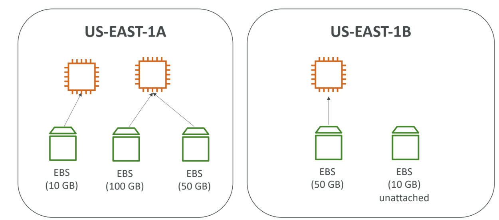
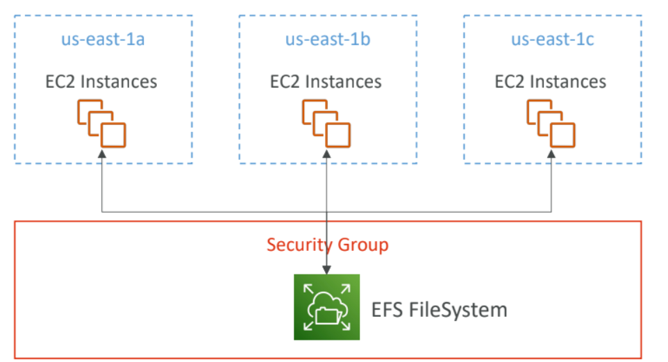

# EBS Volumes

[AWS Official Documentation](https://docs.aws.amazon.com/ebs/latest/userguide/ebs-volumes.html)

## What’s an EBS Volume?

- **Elastic Block Store (EBS)** is network-attached storage for EC2 instances.
- Provides **persistent**, block-level storage volumes.
- Can be used for:
  - Databases
  - File systems
  - Applications needing consistent, low-latency performance
- **Data persists** after instance termination.
- Can only be **attached to one instance at a time**.
- Bound to a specific **Availability Zone (AZ)**.
- **Free Tier**: 30 GB of free EBS (SSD or Magnetic) per month.

---

##  EBS Volume Characteristics

- Automatically replicated within an **AZ**.
- Volume Types:
  - `gp3` / `gp2` – General Purpose
  - `io1` / `io2` – Provisioned IOPS
  - `st1` – Throughput Optimized
  - `sc1` – Cold
- Can be **detached and re-attached** to instances.
- Useful for **preserving root volume** after instance termination.

---

##  EBS – Delete on Termination Attribute

- Controls auto-deletion of EBS volumes when the EC2 instance is terminated.
- **Default:**
  - **Root volume**: deleted
  - **Other volumes**: not deleted
- Can be changed to persist or remove based on need.

---

##  EBS Snapshots

- **Point-in-time backup** of EBS volumes.
- Stored in **Amazon S3**.
- Can be used to:
  - Restore volumes
  - Create new volumes

### Features:
- **Incremental Backups**: Only changed blocks are saved.
- Can be **copied across regions/accounts**.
- **Automate via Amazon DLM** (Data Lifecycle Manager).

###  Snapshot Archive:
- Move to **archive tier** (up to 75% cheaper).
- Takes **24–72 hours** to restore.

###  Recycle Bin for Snapshots:
- Set rules to retain deleted snapshots.
- Retention: **1 day to 1 year**.

---

##  EFS: Elastic File System

- Fully managed **NFS** (Network File System) for EC2.
- Mountable on **hundreds of EC2 instances**.
- **Auto-scales** with data.
- Accessible across **multiple AZs** (high availability & durability).

###  EFS Infrequent Access (EFS-IA):
- Low-cost storage class.
- **Up to 92% cheaper** than EFS Standard.
- Automatically moves files not accessed for **60+ days**.

---

##  Amazon FSx – Overview

- Fully managed file systems for different workloads.
- Launch **3rd party high-performance** file systems on AWS.

### Types:
- **FSx for Windows File Server**
- **FSx for Lustre**
- **FSx for NetApp ONTAP**

####  FSx for Windows File Server:
- Built on Windows Server.
- Supports **SMB protocol**, **NTFS**.
- AD integration, accessible from AWS/on-prem.

####  FSx for Lustre:
- **High-performance** file system.
- Ideal for ML, HPC, video processing.
- **100s GB/s**, **millions of IOPS**, **sub-ms latency**.

---

##  EC2 Instance Store

- **Ephemeral storage** attached to the EC2 host.
- **High I/O**, but **non-persistent**.
- Great for:
  - Caches
  - Buffers
  - Temp files
- Data lost if instance is stopped/terminated.
- **Backups and replication are user responsibility.**

---

## Shared Responsibility Model (EC2 Storage)

| AWS Responsibilities | User Responsibilities |
|----------------------|------------------------|
| Durability & availability of EBS/EFS | Back up data via snapshots, replication |
| Replication within AZ (EBS)         | Access and encryption management |
| Encryption via KMS                  | Encrypt sensitive data at rest |
| Replace faulty hardware             | Ensure data security and recovery |

---

## AMI Overview

- **Amazon Machine Image (AMI)**: Template to launch EC2.
- Includes:
  - OS
  - App server
  - Apps

### Benefits:
- Faster boot time
- Pre-packaged config/software
- Region-specific (can copy to other regions)

### AMI Sources:
- **Public AMI** (AWS provided)
- **Custom AMI** (your own)
- **Marketplace AMI** (third-party)

---

### AMI Creation Process

1. Launch and configure EC2 instance.
2. Create an AMI from it.
3. Launch more instances from this AMI.

---

##  EC2 Image Builder

- Automates **creation & maintenance** of AMIs.
- Ensures compliance and security.
- Integrates with **AWS Systems Manager**.
- Can run **on schedule**.
- **Free service** (you only pay for resources used).

---
