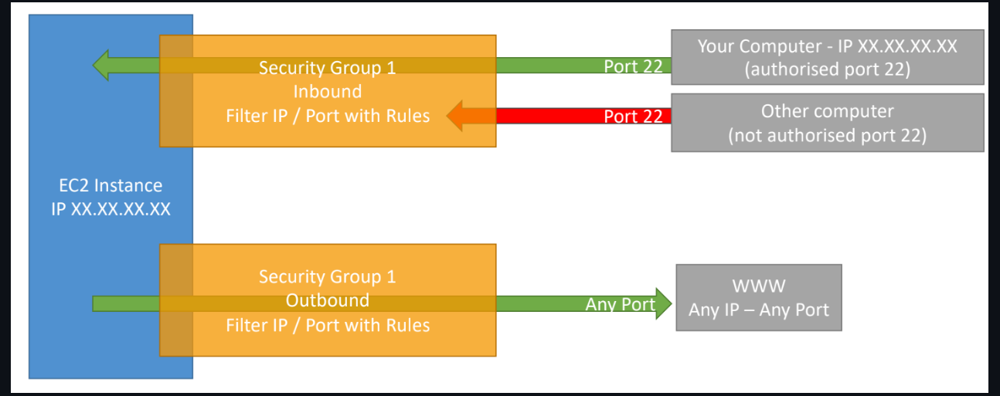

# What is Amazon EC2?

1: Amazon Elastic Compute Cloud (EC2) is a scalable compute service that allows users to rent virtual servers in the cloud.
2: It provides flexibility to scale compute resources up or down based on demand, offering a cost-effective solution for applications with variable workloads.
3: Key features include:

a: On-Demand Instances: Pay for compute capacity by the hour or second, with no long-term commitments.
b: Reserved Instances: Make a one-time payment for a significant discount on instance usage over a one- or three-year term.
c: Spot Instances: Bid for unused EC2 capacity at a potentially lower price, allowing cost savings for flexible workloads.

## EC2 Sizing & Configuration Options

1: EC2 allows for customized sizing and configurations, which include:

a: Instance Type: Selecting the appropriate type based on the application's performance requirements.
b: Storage Options: Using Amazon EBS for persistent block storage or instance store for temporary storage.
c: Networking: Configuring VPCs, subnets, and security groups to control access and manage traffic.
d: Elastic Load Balancing: Distributing incoming traffic across multiple EC2 instances to enhance availability and fault tolerance.
e: Auto Scaling: Automatically adjusting the number of instances based on demand, ensuring the application has the necessary resources.

## EC2 User Data

1: User data is a powerful feature for automating the setup of EC2 instances.
2: It can be specified at instance launch and is executed on the instance when it first boots.
3: bootstrapping means launching commands when a machine starts
4: That script is only run once at the instance first start
5: Common use cases include:
    a: Installing software packages (e.g., yum install httpd -y for Apache).
    b: Downloading configuration files or scripts from Amazon S3.
    c: Configuring system settings and services (e.g., starting an application server).

## EC2 Instance Types - Overview

Amazon EC2 offers a variety of instance types, each designed to meet specific application requirements.(https://aws.amazon.com/ec2/instance-types/)

## General Purpose Instances:

1: General purpose instances provide a balanced mix of compute, memory, and network resources.
2: They are suitable for a variety of workloads and can handle different application types effectively.
3: Use Cases:
    a: Web servers and applications
    b: Small to medium-sized databases
    c: Development and testing environments
    d: Enterprise applications 
   
   
| Instance Type | vCPUs | Memory (GiB) | Network Performance  | Storage   |
|---------------|-------|--------------|----------------------|-----------|
| t4g.micro     | 2     | 1            | Up to 5 Gigabit      | EBS only  |
| t3.micro      | 2     | 1            | Up to 5 Gigabit      | EBS only  |
| m5.large      | 2     | 8            | Up to 10 Gigabit     | EBS only  |
| m5.xlarge     | 4     | 16           | Up to 10 Gigabit     | EBS only  |

## Compute Optimized Instances

1: Compute optimized instances are designed for applications that require high-performance processors and are well-suited for compute-intensive workloads.
2: Use Cases:
    a: High-performance web servers
    b: Batch processing
    c: Data analytics
    d: Machine learning inference

| Instance Type | vCPUs | Memory (GiB) | Network Performance  | Storage   |
|---------------|-------|--------------|----------------------|-----------|
| c5.large      | 2     | 4            | Up to 10 Gigabit     | EBS only  |
| c5.xlarge     | 4     | 8            | Up to 10 Gigabit     | EBS only  |
| c5.2xlarge    | 8     | 16           | Up to 10 Gigabit     | EBS only  |
| c5n.9xlarge   | 36    | 96           | 10 Gigabit           | EBS only  |

## Memory Optimized Instances

1: Memory optimized instances provide high memory bandwidth and are optimized for applications that require large amounts of memory.
2: Use Cases:
    a: High-performance databases (e.g., SAP HANA)
    b: In-memory caches (e.g., Redis, Memcached)
    c: Real-time big data analytics
    d: Data mining applications

| Instance Type   | vCPUs | Memory (GiB) | Network Performance  | Storage   |
|-----------------|-------|--------------|----------------------|-----------|
| r5.large        | 2     | 16           | Up to 10 Gigabit     | EBS only  |
| r5.xlarge       | 4     | 32           | Up to 10 Gigabit     | EBS only  |
| r5.4xlarge      | 16    | 128          | Up to 10 Gigabit     | EBS only  |
| r5b.12xlarge    | 48    | 384          | 10 Gigabit           | EBS only  |

## Storage Optimized Instances

1: Storage optimized instances are designed for applications that require high, sequential read and write access to large datasets.
2: Use Cases:
    a: Data warehousing applications
    b: Hadoop distributed computing
    c: High-frequency trading applications
    d: NoSQL databases (e.g., Cassandra)

| Instance Type | vCPUs | Memory (GiB) | Network Performance  | Storage              |
|---------------|-------|--------------|----------------------|----------------------|
| i3.large      | 2     | 15           | Up to 10 Gigabit     | 1 × 475 GB NVMe SSD  |
| i3.xlarge     | 4     | 30           | Up to 10 Gigabit     | 1 × 950 GB NVMe SSD  |
| i3.2xlarge    | 8     | 61           | Up to 10 Gigabit     | 1 × 1.9 TB NVMe SSD  |
| d2.8xlarge    | 36    | 244          | Up to 10 Gigabit     | 12 × 2 TB HDD        |

## EC2 Instance Types: Example

Here's a quick overview of some example instance types in each category, along with their characteristics:

| Instance Type | vCPUs | Memory (GiB) | Storage                 | Use Case |
|---------------|-------|--------------|-------------------------|----------|
| t3.micro      | 2     | 1            | EBS only                | General-purpose applications with burstable performance; suitable for low-traffic web servers or development environments. |
| c5.large      | 2     | 4            | EBS only                | Compute-intensive applications like gaming, web servers, and machine learning inference. |
| m5.xlarge     | 4     | 16           | EBS only                | Balanced workloads, such as small databases and caching fleets. Ideal for web applications. |
| r5.xlarge     | 4     | 32           | EBS only                | Memory-intensive applications such as databases, in-memory caches, and analytics workloads. |
| i3.2xlarge    | 8     | 61           | 1 × 2.5 TB NVMe SSD     | Storage-intensive applications like NoSQL databases, data warehousing, and big data analytics. |
| p3.2xlarge    | 8     | 61           | EBS only                | GPU-accelerated computing for machine learning, high-performance computing (HPC), and graphics-intensive applications. |

## Introduction to Security Groups

1: Security Groups are virtual firewalls that control inbound and outbound traffic to Amazon EC2 instances.
2: They act at the instance level, not the subnet level, and provide a way to manage access to resources within a VPC (Virtual Private Cloud).
3: Security groups can be associated with multiple instances and can be modified at any time, allowing for flexible management of network access.
4: Key Features:
    a: By default, all inbound traffic is denied, and all outbound traffic is allowed.
    b: You can specify rules based on protocol (TCP, UDP, ICMP), port number, and source IP address or CIDR block.

Common Use Cases

1: Restricting access to an application server (allowing only specific IPs).
2: Allowing traffic from specific ports (e.g., HTTP/HTTPS).
3: Isolating database instances from public access.

Deeper Dive

1: Inbound Rules: Define the traffic allowed into your instances.
2: Outbound Rules: Define the traffic allowed out from your instances.
3: Each rule includes:
    a: Type: The protocol used (e.g., HTTP, SSH).
    b: Protocol: The protocol number (TCP = 6, UDP = 17).
    c: Port Range: The port(s) affected by the rule.
    d: Source/Destination: The IP address or CIDR range from which traffic is allowed.

## Security Groups Diagram

### Examples of Security Group Rules

| Rule Type     | Protocol   | Port Range | Source/Destination               |
|---------------|------------|------------|----------------------------------|
| Inbound Rule  | TCP        | 22         | 203.0.113.0/24 (SSH Access)      |
| Inbound Rule  | TCP        | 80         | 0.0.0.0/0 (HTTP Access)          |
| Outbound Rule | All Traffic| All        | 0.0.0.0/0                        |

## Good to Know

1: Limits: Each security group can have up to 60 inbound and 60 outbound rules by default (this limit can be increased by requesting through AWS Support).
2: Default Security Group: When you create a VPC, a default security group is automatically created, which allows all outbound traffic and denies all inbound traffic by default.
3: Multiple Security Groups: You can assign multiple security groups to a single EC2 instance, enabling fine-grained control over traffic.
4: Security Best Practices:
    a: Apply the principle of least privilege (only allow necessary traffic).
    b: Regularly review and audit security group rules.
    c: Use descriptive names and tags for easy management.

### Classic Ports to Know

| Port Number | Protocol | Service              | Description                                                                 |
|-------------|----------|----------------------|-----------------------------------------------------------------------------|
| 20          | TCP      | FTP (Data Transfer)  | Used for transferring files over FTP.                                       |
| 21          | TCP      | FTP (Control)        | Used for controlling file transfer sessions.                                |
| 22          | TCP      | SSH                  | Secure Shell for secure logins and command execution.                       |
| 80          | TCP      | HTTP                 | Hypertext Transfer Protocol for web traffic.                                |
| 443         | TCP      | HTTPS                | Secure HTTP for secure web traffic.                                         |
| 3389        | TCP      | RDP                  | Used for Remote Desktop Protocol, allowing users to connect to and control remote Windows machines. |

## EC2 Instance Launch Types

1: On Demand Instances: short workload, predictable pricing
2: Reserved: (1 & 3 years)
    a: Reserved Instances: long workloads
    b: Convertible Reserved Instances: long workloads with flexible instances
3: Savings Plans (1 & 3 years): commitment to an amount of usage, long workload
4: Spot Instances: short workloads, for cheap, can lose instances
5: Dedicated Instances: no other customers will share your hardware
6: Dedicated Hosts: book an entire physical server, control instance placement
7: Capacity Reservations: reserve capacity in a specific AZ for any duration

## On Demand Instance

1: Pay for what you use:
    a: Linux or Windows - billing per second, after the first minute
    b: All other operating systems - billing per hour
2: Has the highest cost but no upfront payment
3: No long-term commitment
4: Recommended for short-term and un-interrupted workloads, where you can't predict how the application will behave

## Reserved Instances

1: Up to 72% discount compared to On-demand

2: You reserve a specific instance attributes (Instance Type, Region, Tenancy, OS)

3: Reservation Period – 1 year (+discount) or 3 years (+++discount)

4: Payment Options – No Upfront (+), Partial Upfront (++), All Upfront (+++)

5: Reserved Instance’s Scope – Regional or Zonal (reserve capacity in an AZ)

6: Recommended for steady-state usage applications (think database)

7: You can buy and sell in the Reserved Instance Marketplace

8: Convertible Reserved Instance

    a: Can change the EC2 instance type, instance family, OS, scope and tenancy
    b: Up to 66% discount

## Savings Plans

1: Get a discount based on long-term usage (up to 72% - same as RIs)

2: Commit to a certain type of usage ($10/hour for 1 or 3 years)

3: Usage beyond EC2 Savings Plans is billed at the On-Demand price

4: Locked to a specific instance family & AWS region (e.g., M5 in us-east-1)

5: Flexible across:

    a: Instance Size (e.g., m5.xlarge, m5.2xlarge)
    b: OS (e.g., Linux, Windows)
    c: Tenancy (Host, Dedicated, Default)

## Spot Instances

1: Can get a discount of up to 90% compared to On-demand
2: Instances that you can “lose” at any point of time if your max price is less than the current spot price
3: The MOST cost-efficient instances in AWS
4: Useful for workloads that are resilient to failure
    a: Batch jobs
    b: Data analysis
    c: Image processing
    d: Any distributed workloads
    e: Workloads with a flexible start and end time
5: Not suitable for critical jobs or databases

## Dedicated Hosts

1: A physical server with EC2 instance capacity fully dedicated to your use
2: Allows you to address compliance requirements and use your existing server- bound software licenses (per-socket, per-core, pe—VM software licenses)
3: Purchasing Options:
    a: On-demand – pay per second for active Dedicated Host
    b: Reserved - 1 or 3 years (No Upfront, Partial Upfront, All Upfront)
4: The most expensive option
5: Useful for software that have complicated licensing model (BYOL – Bring Your Own License)
6: Or for companies that have strong regulatory or compliance needs

## Dedicated Instances

1: Instances run on hardware that’s dedicated to you
2: May share hardware with other instances in same account
3: No control over instance placement (can move hardware after Stop / Start)

## Capacity Reservations

1: Reserve On-Demand instances capacity in a specific AZ for any duration
2: You always have access to EC2 capacity when you need it
3: No time commitment (create/cancel anytime), no billing discounts
4: Combine with Regional Reserved Instances and Savings Plans to benefit from billing discounts
5: You’re charged at On-Demand rate whether you run instances or not
6: Suitable for short-term, uninterrupted workloads that needs to be in a specific AZ    

## EC2 Section – Summary

1: EC2 Instance: AMI (OS) + Instance Size (CPU + RAM) + Storage + security groups + EC2 User Data

2: Security Groups: Firewall attached to the EC2 instance

3: EC2 User Data: Script launched at the first start of an instance

4: SSH: start a terminal into our EC2 Instances (port 22)

5: EC2 Instance Role: link to IAM roles

6: Purchasing Options: On-Demand, Spot, Reserved (Standard + Convertible + Scheduled), Dedicated Host, Dedicated Instance