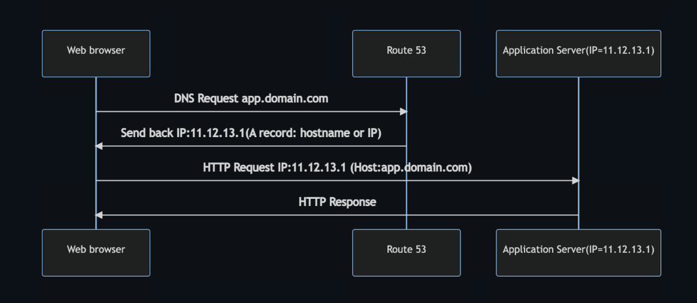

# Why Make a Global Application?

A global application is an application deployed in multiple geographies.  
On AWS, this could mean deploying across **Regions** and/or **Edge Locations**.

## Benefits of a Global Application

### Decreased Latency  
Latency is the time it takes for a network packet to reach a server.  
It takes longer for a packet from Asia to reach the US.  
Deploy your applications closer to your users to decrease latency and improve user experience.

### Disaster Recovery (DR)  
If an AWS region goes down (earthquake, storms, power shutdown, politics, etc.),  
you can fail-over to another region and keep your application running.  
A disaster recovery plan is important to increase application availability.

### Attack Protection  
Distributed global infrastructure is harder to attack.

## Global AWS Infrastructure

- **Regions:** For deploying applications and infrastructure.  
- **Availability Zones:** Composed of multiple data centers within a region.  
- **Edge Locations (Points of Presence):** For content delivery as close as possible to users.  

More info: [AWS Global Infrastructure](https://infrastructure.aws/)

## Global Applications in AWS

- **Global DNS: Route 53**  
  Routes users to the closest deployment with the least latency.  
  Supports disaster recovery strategies.

- **Global Content Delivery Network (CDN): CloudFront**  
  Replicates part of your application to AWS Edge Locations to decrease latency.  
  Caches common requests for improved user experience.

- **S3 Transfer Acceleration**  
  Accelerates global uploads and downloads into Amazon S3.

- **AWS Global Accelerator**  
  Improves global application availability and performance using the AWS global network.

---

# Amazon Route 53 Overview

Route 53 is a managed DNS (Domain Name System) service.  

DNS is a collection of rules and records that help clients find how to reach a server via URLs.

Common DNS records in AWS:

| Record Type | Example                             | Description                      |
|-------------|-----------------------------------|---------------------------------|
| A           | www.google.com => 12.34.56.78     | IPv4 address record             |
| AAAA        | www.google.com => IPv6 address    | IPv6 address record             |
| CNAME       | search.google.com => www.google.com | Hostname to hostname alias     |
| Alias       | example.com => AWS resource       | Alias to AWS resources (ELB, CloudFront, S3, RDS, etc.) |

## Route 53 - Diagram for A Record

# Route 53 Routing Policies

Need to know these at a high-level for the Cloud Practitioner Exam:

- **Simple Routing Policy**  
- **Weighted Routing Policy**  
- **Latency Routing Policy**  
- **Failover Routing Policy**  

---

### Simple Routing Policy  
- Use for a single resource performing a given function for your domain (e.g., a web server for example.com).  
- Can be used to create records in a private hosted zone.

### Weighted Routing Policy  
- Route traffic to multiple resources in proportions you specify.  
- Can be used in private hosted zones.

### Latency Routing Policy  
- Route traffic to the AWS region that provides the best latency.  
- Useful when you have resources in multiple AWS regions.  
- Can be used in private hosted zones.

### Failover Routing Policy  
- Configure active-passive failover to maintain availability.  
- Can be used in private hosted zones.

---

# AWS CloudFront

- Content Delivery Network (CDN) that improves read performance by caching content at edge locations.  
- Enhances user experience globally.  
- 216 Points of Presence worldwide (Edge Locations).  
- Provides DDoS protection, integrated with AWS Shield and AWS WAF.  
- [More info](https://aws.amazon.com/cloudfront/features/?nc=sn&loc=2)

### CloudFront Origins  
- **S3 Bucket:** Distribute files, cache at edges, enhanced security with Origin Access Identity (OAI).  
- **Custom Origin (HTTP):** Application Load Balancer, EC2 instance, S3 website (static), or any HTTP backend.

### CloudFront vs S3 Cross Region Replication

| Feature                   | CloudFront                             | S3 Cross Region Replication               |
|---------------------------|--------------------------------------|-------------------------------------------|
| Network                   | Global Edge Network                   | Must be set up for each replication region |
| Update Frequency          | Cached files with TTL (e.g., ~1 day) | Near real-time replication                  |
| Use Case                  | Static content available everywhere  | Dynamic content with low latency in few regions |
  
---

# S3 Transfer Acceleration

- Speeds up transfers by routing files through AWS Edge Locations to the target S3 bucket.  
- Example: Upload file in USA → Edge Location (USA) → S3 Bucket (Australia).  
- Test speed here: [S3 Accelerate Speedtest](https://s3-accelerate-speedtest.s3-accelerate.amazonaws.com/en/accelerate-speed-comparsion.html)

---

# AWS Global Accelerator

- Improves global application availability and performance using AWS’s private global network.  
- Routes traffic via the AWS global network instead of the internet.  
- Offers ~60% performance improvement by optimizing routing.  
- Creates 2 Anycast IPs for your app, traffic sent through Edge Locations.  
- Test speed here: [Global Accelerator Speedtest](https://speedtest.globalaccelerator.aws/#/)

### AWS Global Accelerator vs CloudFront

| Feature             | CloudFront                               | Global Accelerator                         |
|---------------------|-----------------------------------------|--------------------------------------------|
| Purpose             | CDN for cacheable content (images, videos) | Proxying packets to applications (TCP/UDP) |
| Caching             | Yes                                     | No                                         |
| Use Cases           | Static content delivery                  | Apps needing static IPs & fast failover    |
| DDoS Protection     | Integrated with AWS Shield               | Integrated with AWS Shield                  |

---

# AWS Outposts

- Hybrid cloud solution: extend AWS infrastructure and services on-premises.  
- AWS manages the Outposts racks physically installed in your data center.  
- You maintain physical security of the racks.  

### Benefits

- Low-latency access to on-prem systems  
- Local data processing & data residency  
- Easier migration to cloud  
- Fully managed service  

### Supported Services on Outposts

- EC2, EBS, S3, EKS, ECS, RDS, EMR  

---

# AWS Wavelength

- AWS infrastructure embedded in 5G telecom providers’ data centers.  
- Brings AWS services (EC2, EBS, VPC) closer to 5G network edge.  
- Enables ultra-low latency applications with traffic staying within the CSP network.  
- No extra charges or service agreements.  

### Use Cases  
Smart Cities, ML diagnostics, Connected Vehicles, Interactive Live Video, AR/VR, Real-time Gaming.

---

# AWS Local Zones

- Places AWS compute, storage, database, and other services closer to end-users.  
- Extends your VPC to additional locations as an “extension” of an AWS Region.  
- Compatible with EC2, RDS, ECS, EBS, ElastiCache, Direct Connect, etc.  

### Example  
- Region: N. Virginia (us-east-1)  
- Local Zones: Boston, Chicago, Dallas, Houston, Miami  

---

# Global Applications - Summary

| Service                  | Purpose                                                                                 |
|--------------------------|-----------------------------------------------------------------------------------------|
| **Route 53**             | Global DNS for routing users to closest deployment & disaster recovery                  |
| **CloudFront**           | CDN to replicate application at Edge Locations, decrease latency, cache requests        |
| **S3 Transfer Acceleration** | Accelerate global uploads/downloads to S3                                             |
| **AWS Global Accelerator** | Improve global app availability & performance via AWS global network                   |
| **AWS Outposts**         | Deploy AWS services on-premises via managed racks                                       |
| **AWS Wavelength**       | Bring AWS services to 5G network edge for ultra-low latency applications                 |
| **AWS Local Zones**      | Bring AWS resources closer to users for latency-sensitive applications                   |
