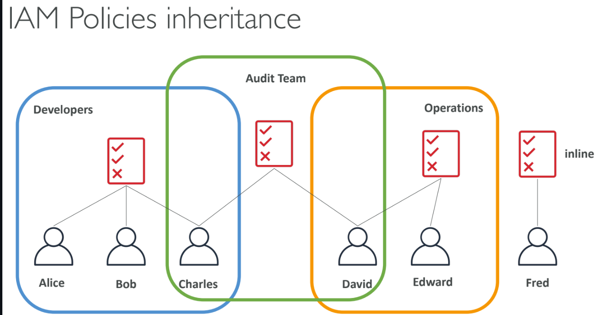

# What Is IAM?...

1: Identity and Access Management (IAM) is a web service for securely controlling access to AWS resources.

2: Allows you to manage:
    
    a: Users: Individual identities who interact with AWS services.
    
    b: Groups: Collection of IAM users with similar access permissions.
    
    c: Roles: Set of permissions to be assumed by AWS services or applications.

# IAM: Users & Groups:

1: Users: Represent individual identities that interact with AWS services. Users have unique credentials (username, password, access keys).

2: Groups: Logical grouping of users to simplify permission management.
    a: Permissions assigned to a group are automatically inherited by its users.

3: Flexibility in User Management in IAM, users do not have to belong to a group, and a user can belong to multiple groups. This allows user to manage access permissions in a granular and efficient manner. For example, a user could belong to both the “QAs" group and the “Developers” group, inheriting permissions from both.

IAM Users                                                    IAM Groups

Unique identity for accessing AWS services.	                 Logical grouping of users to apply common permissions.

Each user has individual permissions based on policies.	     Adding/removing users from groups automatically changes their permissions.

# IAM: Permissions:

1: Permissions are defined using policies.

2: Policies specify what actions are allowed or denied on specific resources.

3: Policies can be attached to:
        a: Users
        b: Groups
        c: Roles

# IAM Policies Inheritance:

1: Policies are evaluated together for a user, including:

        a: Directly attached policies.

        b: Group policies.

        c:Policies attached to roles.

2: If multiple policies apply, IAM combines them to evaluate the final permission set.

Policy Type	                    Description

Inline Policies	                Directly attached to a single user, group, or role.

Managed Policies	            Reusable policies created and maintained by AWS (AWS-managed) or the customer (Customer-managed).

Group Inherited Policies        Policies assigned to groups apply to all users in that group.
	

# IAM Policies Structure:

1: Policies are JSON documents that define permissions.

2: Key elements of a policy:

        a: Version: Policy language version (e.g., 2012-10-17).

        b: Statement: Contains one or more permissions (allow or deny).

        c: Action: Specifies which AWS service actions are allowed or denied.

        d: Resource: Specifies the AWS resources to which the actions apply.

        e: Effect: Either Allow or Deny.

# IAM – Password Policy:

1: AWS allows you to define a password policy for IAM users to ensure strong security standards.

2: You can enforce specific rules to make sure passwords are complex and secure.

Common Password Policy Settings:

1: Minimum password length: Set a minimum number of characters (e.g., at least 8 characters).

2: Require specific character types:

        a: Lowercase letters.

        b: Uppercase letters.

        c: Numbers.

        d: Non-alphanumeric characters (special symbols like !, @, #).

3: Prevent password reuse: Enforce that new passwords cannot be the same as recently used passwords (e.g., prevent using the last 3 passwords).

4: Password expiration: Set the password to expire after a certain period (e.g., 90 days) to prompt users to change their passwords.

5: Enable Multi-Factor Authentication (MFA): Enforce MFA for extra security, requiring both a password and a second authentication factor.

# IAM Roles for Services:

1: IAM roles are used to grant permissions to AWS services to perform actions on behalf of users or applications.

2: Example use cases for IAM roles:

        a: An EC2 instance can assume a role to access S3 buckets without the need for storing long-term credentials.

        b: Lambda functions can use roles to interact with other AWS services without hardcoding access keys.

# IAM Security Tools:

1: IAM Credential Report:

        a: A report that provides details about all IAM users in the AWS account, including the status of their passwords and access 
        keys.
        
        b: Useful for auditing and reviewing user credentials.

2: IAM Access Advisor:

        a: Shows service permissions granted to a user and indicates the last time those permissions were used.

        b: Helps identify unnecessary permissions that can be revoked for least privilege.

3: IAM Policy Simulator:

        a: A tool that lets you test and validate the impact of IAM policies before applying them to users, groups, or roles.

        b: Helps to understand which actions are allowed or denied based on current policies.

# IAM Guidelines & Best Practices:

1: Follow the Principle of Least Privilege:

        a: Grant only the permissions required to perform a specific task.

        b: Regularly review and adjust permissions as needed.
        
2: Enable Multi-Factor Authentication (MFA):

        a: Enforce MFA for privileged IAM users (e.g., admin accounts).

        b: Adds an additional layer of security by requiring users to provide a code from an MFA device along with their password.
         
3: Use IAM Roles Instead of IAM Users for Applications:

        a: Assign roles to AWS resources instead of using IAM user credentials in code or configuration files.

        b: Prevents security issues that could arise from accidental exposure of long-term credentials.
    
4: Rotate IAM Credentials Regularly:

        a: Regularly rotate IAM access keys and passwords.

        b: Remove unused credentials to reduce risk.

5: Use AWS Managed Policies for Common Use Cases:

        a: AWS provides a set of predefined managed policies that are regularly updated.

        b: Managed policies are designed for common use cases and provide a good starting point for granting permissions.

# Shared Responsibility Model for IAM:

1: AWS Responsibility:

        a: Protect the infrastructure that runs AWS services.

        b: Provide IAM service availability.

        c: Offer managed policies for common scenarios.

2: Customer Responsibility:

        a: Manage IAM users, groups, and roles.

        b: Configure IAM policies correctly and apply the principle of least privilege.

        c: Secure IAM credentials and enable MFA.

        d: Regularly audit permissions using tools like IAM Credential Report and Access Advisor.        

# Multi-Factor Authentication (MFA):

1: MFA adds an extra layer of protection on top of a username and password.

2: With MFA enabled, when a user signs in, they must provide:

        a: Their password (something they know).

        b: An authentication code from their MFA device (something they have).

3: Even if a user’s password is compromised, MFA can prevent unauthorized access.

Benefits of MFA:

1: Enhances account security by requiring a second form of authentication.

2: Reduces the risk of credential compromise and unauthorized access.

3: AWS recommends enabling MFA for all IAM users, especially for root accounts and privileged users.

4: Main benefit of MFA: if a password is stolen or hacked, the account is not compromised

# MFA Devices Options in AWS:

AWS supports several types of MFA devices:

MFA Device Type	                        Description

Virtual MFA Device	                    Uses apps like Google Authenticator or Authy. Generates a time-based one-time password (TOTP) 
                                        on a smartphone or tablet.

Hardware MFA Device	                    Physical devices like Gemalto tokens that generate time-based codes.

U2F Security Key	                    USB devices supporting the Universal 2nd Factor (U2F) standard. Typically used for 
                                        browser-based sign-ins.

AWS Multi-Factor Authentication (MFA)	AWS offers its own MFA solutions integrated with IAM to easily configure and manage MFA devices 
                                        for users.

# How Can Users Access AWS?

AWS provides multiple ways for users to access resources:

Access Method	                        Description

AWS Management Console	               A web-based user interface for interacting with and managing AWS resources visually. Best for 
                                       beginners and infrequent tasks.

AWS Command Line Interface (CLI)	   A unified tool to interact with AWS services using commands in your terminal. Suitable for 
                                       automation and developers.               

AWS Software Development Kits (SDKs)   Language-specific APIs for programmatically accessing AWS services using programming languages 
                                       like Python, JavaScript, Java, Ruby, etc.

AWS CloudFormation	                   A service to define and provision AWS infrastructure using code (Infrastructure as Code – IaC). 
                                       Allows creating stacks and automating deployment     configurations.                                     

# What’s the AWS CLI?

1: AWS CLI (Command Line Interface) is a unified tool to manage AWS services through your terminal or command prompt.

2: It allows you to issue commands and automate tasks across multiple AWS services.

3: Supports both Windows, macOS, and Linux.

4: Direct access to the public APIs of AWS services

Key Features of AWS CLI:

1: Command automation: Write scripts to automate frequent AWS tasks.

2: Access to all services: Interact with any AWS service and manage resources from the command line.

3: Profile management: Manage multiple AWS accounts using different named profiles.

4: JSON and YAML output: Format CLI responses for better readability or integration with other tools.

# What’s the AWS SDK?

1: AWS SDK (Software Development Kit) allows developers to interact with AWS services using various programming languages.

2: Supports languages like Python (boto3), JavaScript (aws-sdk), Java, .NET, Ruby, PHP, and more.

3: SDKs provide simplified APIs, making it easier to work with AWS services programmatically without dealing with low-level API calls.

Key Features of AWS SDK:

1: API abstraction: Higher-level abstractions simplify complex operations like S3 object uploads or DynamoDB queries.

2: Cross-service integration: SDKs help integrate multiple AWS services together within applications.

3: Authentication: Easily manage credentials and authenticate requests using IAM roles or user access keys.

4: Retry logic: Handles transient network issues with built-in retry logic.

# IAM Section – Summary:

1: Users: Mapped to a physical user, has a username and password for AWS Management Console access.

2: Groups: Contains users and allows applying common permissions to multiple users.

3: Policies: JSON document that defines permissions for users, groups, or roles.

4: Roles: Assign to AWS services (e.g., EC2, Lambda) for accessing other resources without credentials.

5: Permissions: Allow or deny actions on AWS resources, defined using policies.

6: MFA: Multi-Factor Authentication for an additional layer of security beyond username and password.

7: Password Policy: Enforce password complexity, rotation, and reuse rules for IAM users.

8: AWS CLI: Command-line tool to interact with AWS services and automate tasks.

9: AWS SDK: Use programming languages (e.g., Python, JavaScript) to manage AWS services programmatically.

10: Access Keys: Key pairs used to authenticate when accessing AWS using the CLI or SDK.

11: Audit Tools: IAM Credential Report lists user credentials; Access Advisor shows service permissions usage.

