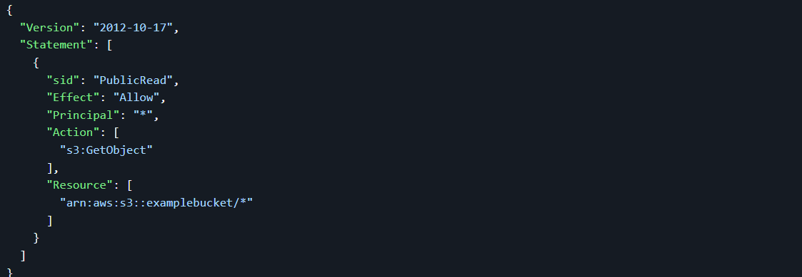

# S3 Use Cases

- Backup and storage  
- Disaster Recovery  
- Archive  
- Hybrid Cloud storage  
- Application hosting  
- Media hosting  
- Data lakes & big data analytics  
- Software delivery  
- Static website  

---

## Amazon S3 Overview - Buckets

Amazon S3 allows people to store objects (files) in “buckets” (directories).  
Buckets must have a globally unique name (across all regions all accounts).  
Buckets are defined at the region level.  
S3 looks like a global service but buckets are created in a region.

### Naming convention

- No uppercase  
- No underscore  
- 3-63 characters long  
- Not an IP  
- Must start with lowercase letter or number  

---

## Amazon S3 Overview - Objects

Objects (files) have a Key.  
The key is the FULL path:  
`s3://my-bucket/my_file.txt`  
`s3://my-bucket/my_folder1/another_folder/my_file.txt`  

The key is composed of prefix + object name:  
`s3://my-bucket/my_folder1/another_folder/my_file.txt`  

There’s no concept of “directories” within buckets (although the UI will trick you to think otherwise).  
Just keys with very long names that contain slashes (“/”).

Object values are the content of the body:  
- Max Object Size is 5TB (5000GB)  
- If uploading more than 5GB, must use “multi-part upload”  

Metadata (list of text key / value pairs – system or user metadata)  
Tags (Unicode key / value pair – up to 10) – useful for security / lifecycle  
Version ID (if versioning is enabled)  

---

## S3 Security

- User based  
  - IAM policies - which API calls should be allowed for a specific user from IAM console  
- Resource Based  
  - Bucket Policies - bucket wide rules from the S3 console - allows cross account  
  - Object Access Control List (ACL) – finer grain  
  - Bucket Access Control List (ACL) – less common  

**Note:** an IAM principal can access an S3 object if  
the user IAM permissions allow it OR the resource policy ALLOWS it  
AND there’s no explicit DENY  

Encryption: encrypt objects in Amazon S3 using encryption keys  

---

## S3 Bucket Policies

- JSON based policies  
- Resources: buckets and objects  
- Actions: Set of API to Allow or Deny  
- Effect: Allow / Deny  
- Principal: The account or user to apply the policy to  

Use S3 bucket for policy to:  
- Grant public access to the bucket  
- Force objects to be encrypted at upload  
- Grant access to another account (Cross Account)  

Example policy:

# Bucket settings for Block Public Access

- **Block all public access:** On  
- **Block public access to buckets and objects granted through new access control lists (ACLS):** On  
- **Block public access to buckets and objects granted through any access control lists (ACLS):** On  
- **Block public access to buckets and objects granted through new public bucket or access point policies:** On  
- **Block public and cross-account access to buckets and objects through any public bucket or access point policies:** On  

_These settings were created to prevent company data leaks._

If you know your bucket should never be public, leave these on.

_Can be set at the account level._

---

## S3 Websites

- S3 can host static websites and have them accessible on the www  
- The website URL will be:  
  `bucket-name.s3-website-AWS-region.amazonaws.com` OR  
  `bucket-name.s3-website.AWS-region.amazonaws.com`  
- If you get a 403 (Forbidden) error, make sure the bucket policy allows public reads!

---

## S3 - Versioning

- You can version your files in Amazon S3  
- It is enabled at the bucket level  
- Same key overwrite will increment the **version**: 1, 2, 3…  
- Best practice to version your buckets  
- Protect against unintended deletes (ability to restore a version)  
- Easy rollback to previous version  

**Notes:**  
- Any file that is not versioned prior to enabling versioning will have version `null`  
- Suspending versioning does not delete the previous versions  

---

## S3 Access Logs

- For audit purposes, you may want to log all access to S3 buckets  
- Any request made to S3, from any account, authorized or denied, will be logged into another S3 bucket  
- That data can be analyzed using data analysis tools  
- Very helpful to find root cause of issues, audit usage, view suspicious patterns, etc.

---

## S3 Replication (CRR & SRR)

- Must enable versioning in source and destination  
- Cross Region Replication (CRR)  
- Same Region Replication (SRR)  
- Buckets can be in different accounts  
- Copying is asynchronous  
- Must give proper IAM permissions to S3  

**Use cases:**  
- CRR: compliance, lower latency access, replication across accounts  
- SRR: log aggregation, live replication between production and test accounts  

---

## S3 Storage Classes

Amazon S3 Standard - General Purpose

Amazon S3 Standard - Infrequent Access (IA)

Amazon S3 One Zone - Infrequent Access

Amazon S3 Glacier Instant Retrieval

Amazon S3 Glacier Flexible Retrieval

Amazon S3 Glacier Deep Archive

Amazon S3 Intelligent Tiering 

Can move between classes manually or using S3 Lifecycle configurations.

---

## S3 Durability and Availability

**Durability:**  
- High durability (99.999999999%, 11 9’s) of objects across multiple AZ  
- If you store 10,000,000 objects with Amazon S3, expect loss of a single object once every 10,000 years  
- Same for all storage classes  

**Availability:**  
- Measures how readily available a service is  
- Varies depending on storage class  
- Example: S3 standard has 99.99% availability = ~53 minutes downtime per year  

---

## S3 Standard General Purpose

- 99.99% Availability  
- Used for frequently accessed data  
- Low latency and high throughput  
- Sustains 2 concurrent facility failures  
- Use cases: Big Data analytics, mobile & gaming applications, content distribution  

---

## S3 Storage Classes - Infrequent Access

- For data less frequently accessed but requires rapid access when needed  
- Lower cost than S3 Standard  

**S3 Standard Infrequent Access (S3 Standard-IA):**  
- 99.9% Availability  
- Use cases: Disaster Recovery, backups  

**S3 One Zone Infrequent Access (S3 One Zone-IA):**  
- High durability (99.999999999%) in a single AZ; data lost if AZ destroyed  
- 99.5% Availability  
- Use cases: Storing secondary backup copies of on-premise data, or data you can recreate  

---

## Amazon S3 Glacier Storage Classes

- Low-cost object storage for archiving / backup  
- Pricing: storage + object retrieval cost  

**Amazon S3 Glacier Instant Retrieval:**  
- Millisecond retrieval, great for data accessed once a quarter  
- Minimum storage duration of 90 days  

**Amazon S3 Glacier Flexible Retrieval (formerly Glacier):**  
- Expedited (1 to 5 minutes), Standard (3 to 5 hours), Bulk (5 to 12 hours) – free  
- Minimum storage duration of 90 days  

**Amazon S3 Glacier Deep Archive:**  
- For long-term storage  
- Standard (12 hours), Bulk (48 hours)  
- Minimum storage duration of 180 days  

---

## S3 Intelligent-Tiering

- Small monthly monitoring and auto-tiering fee  
- Moves objects automatically between access tiers based on usage  
- No retrieval charges in S3 Intelligent-Tiering  

**Tiers:**  
- Frequent Access (automatic): default  
- Infrequent Access (automatic): objects not accessed for 30 days  
- Archive Instant Access (automatic): objects not accessed for 90 days  
- Archive Access (optional): configurable from 90 to 700+ days  
- Deep Archive Access (optional): configurable from 180 to 700+ days  

---

## S3 Object Lock & Glacier Vault Lock

- **S3 Object Lock:**  
  - Adopt WORM (Write Once Read Many) model  
  - Block object version deletion for a specified time  

- **Glacier Vault Lock:**  
  - Adopt WORM model  
  - Lock policy for future edits (cannot be changed)  
  - Helpful for compliance and data retention  

---

## Shared Responsibility Model for S3

| AWS                                        | YOU                                         |
|--------------------------------------------|---------------------------------------------|
| Infrastructure (global security, durability, availability, sustain concurrent loss of data in two facilities) | S3 Versioning, S3 Bucket Policies, S3 Replication Setup |
| Configuration and vulnerability analysis   | Logging and Monitoring, S3 Storage Classes  |
| Compliance validation                       | Data encryption at rest and in transit      |

---

## AWS Snow Family

Highly-secure, portable devices to collect and process data at the edge, and migrate data into and out of AWS.

### Data migration devices:
- Snowcone  
- Snowball Edge  
- Snowmobile  

### Edge computing devices:
- Snowcone  
- Snowball Edge  

---

## Data Migrations with AWS Snow Family

Offline devices to perform data migrations when network transfer takes too long.

**Challenges:**  
- Limited connectivity  
- Limited bandwidth  
- High network cost  
- Shared bandwidth (can’t maximize line)  
- Connection stability  

| Data Size | 100 Mbps | 1 Gbps | 10 Gbps |
|-----------|----------|--------|---------|
| 10 TB     | 12 days  | 30 hrs | 3 hrs   |
| 100 TB    | 124 days | 12 days| 30 hrs  |
| 1 PB      | 3 years  | 124 days| 12 days |

---

## Snowball Edge (for data transfers)

- Physical data transport solution to move TBs or PBs of data  
- Alternative to network transfer  
- Pay per data transfer job  
- Provides block storage and Amazon S3-compatible object storage  

Types:  
- Storage Optimized: 80 TB HDD for block volume & S3 compatible storage  
- Compute Optimized: 42 TB HDD for block volume & S3 compatible storage  

Use cases: large data cloud migrations, DC decommission, disaster recovery

---

## AWS Snowcone

- Small, portable, rugged & secure edge computing device  
- Lightweight (4.5 lbs / 2.1 kg)  
- 8 TB usable storage  
- Used in space-constrained environments  
- Requires user-provided battery/cables  
- Can be sent back offline or use AWS DataSync to transfer data  

---

## AWS Snowmobile

- Transfer exabytes of data (1 EB = 1,000 PB = 1,000,000 TB)  
- Each Snowmobile has 100 PB capacity (multiple can be used in parallel)  
- Highly secure: temperature controlled, GPS, 24/7 video surveillance  
- Better for >10 PB data transfers  

---

## Snow Family - Usage Process

1. Request Snowball devices from AWS Console  
2. Install Snowball client / AWS OpsHub on your servers  
3. Connect Snowball and copy files using the client  
4. Ship back device when done (goes to the right AWS facility)  
5. Data loaded into an S3 bucket  
6. Snowball is completely wiped  

---

## What is Edge Computing?

- Process data as it's created on edge locations like trucks, ships, mining stations  
- Often limited/no internet or computing power available  
- Use Snowball Edge / Snowcone for edge computing  

Use cases:  
- Preprocess data  
- Machine learning at the edge  
- Transcoding media streams  
- Ship device back to AWS if needed  

---

## Snow Family - Edge Computing Devices

| Device                      | Specs                                   |
|-----------------------------|----------------------------------------|
| Snowcone (smaller)          | 2 CPUs, 4 GB memory, wired/wireless access, USB-C power or battery |
| Snowball Edge - Compute Opt | 52 vCPUs, 208 GiB RAM, optional GPU, 42 TB storage |
| Snowball Edge - Storage Opt | Up to 40 vCPUs, 80 GiB RAM, object storage clustering |

All run EC2 Instances & AWS Lambda functions (via AWS IoT Greengrass)  
Long-term options: 1 and 3 year discounted pricing

---

## AWS OpsHub

- GUI software to manage Snow Family devices  
- Unlock/configure devices, transfer files, manage instances  
- Monitor device metrics  
- Launch compatible AWS services on devices (EC2, DataSync, NFS)  

---

## Hybrid Cloud for Storage

- Mix of on-premises infrastructure & AWS Cloud  
- Due to migrations, security, compliance, IT strategy  

Challenge: S3 is proprietary, how to expose on-premises?

### AWS Storage Gateway

- Bridges on-premises and cloud storage (S3)  
- Use cases: disaster recovery, backup, tiered storage  

Types:  
- File Gateway  
- Volume Gateway  
- Tape Gateway  

---

## Amazon S3 - Summary

- Buckets vs Objects: global unique name, tied to a region  
- S3 security: IAM policy, Bucket Policy, Encryption  
- S3 Websites: host static websites  
- S3 Versioning: multiple file versions, prevent accidental deletes  
- S3 Access Logs: track bucket requests  
- S3 Replication: same-region or cross-region, needs versioning  
- S3 Storage Classes: Standard, IA, 1Z-IA, Intelligent, Glacier, Glacier Deep Archive  
- S3 Lifecycle Rules: transition objects between classes  
- S3 Glacier Vault Lock & Object Lock: WORM model  
- Snow Family: physical devices for data import & edge computing  
- OpsHub: desktop app for Snow Family management  
- Storage Gateway: hybrid on-prem/cloud solution  
