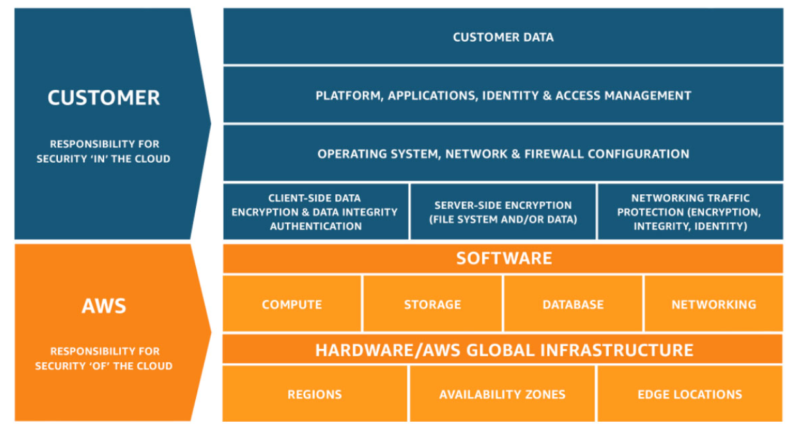
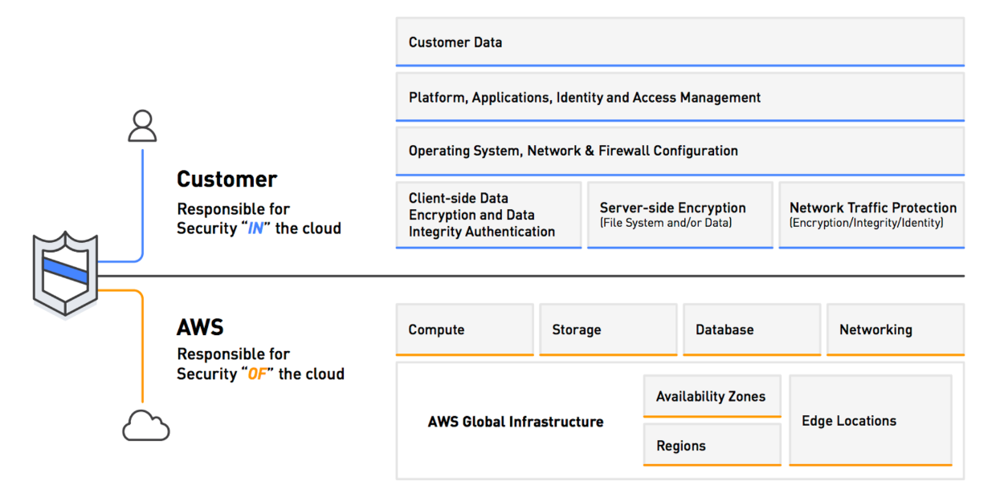
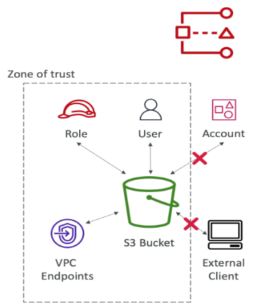

# Security & Compliance

## AWS Shared Responsibility Model

The **AWS Shared Responsibility Model** defines how security and compliance responsibilities are distributed between AWS and the customer.

---

## 🔐 Core Principle

| Responsibility Area       | Who’s Responsible |
|---------------------------|------------------|
| **Security of the Cloud** | **AWS** – responsible for protecting the infrastructure that runs AWS services |
| **Security in the Cloud** | **Customer** – responsible for securing data, configurations, identity, and applications |

---

## 🛡️ Shared Controls

Some security and compliance responsibilities are shared between AWS and the customer:

- **Patch Management** – AWS patches infrastructure; customers patch OS/applications
- **Configuration Management** – AWS provides secure defaults; customers configure to meet business needs
- **Awareness & Training** – AWS maintains secure operations; customers train users on secure usage

---

## 🔄 Shared Responsibility Categories

| Aspect                   | AWS Responsibility                                 | Customer Responsibility |
|--------------------------|----------------------------------------------------|--------------------------|
| **Infrastructure**       | Physical security, hardware, and global network    | Not applicable |
| **Configuration**        | Default service configurations                     | Customize to meet security needs |
| **Data Protection**      | Provide encryption tools and capabilities          | Implement encryption and manage access |
| **Patching**             | Infrastructure-level patches                       | OS and application-level patches |
| **Access Management**    | Provide IAM services                               | Define and manage IAM policies and permissions |

---

## 💾 Example: Amazon RDS

### AWS Responsibilities:
- Managing the underlying **database engine** (e.g., MySQL, PostgreSQL)
- Ensuring **hardware security** and **network isolation**
- Applying **database software patches**
- Auditing the **host instance** and **disks**
- Ensuring high **availability and durability**

### Customer Responsibilities:
- Managing **database credentials** and **access control**
- **Encrypting data** at rest and in transit
- Defining **backup and recovery policies**
- Monitoring **performance** with Amazon CloudWatch
- Enforcing **SSL connections** via parameter groups

---

## 🗃️ Example: Amazon S3

### AWS Responsibilities:
- Ensuring **durability and availability** of object data
- Managing **infrastructure-level security**
- Guaranteeing **unlimited storage capacity**
- Preventing **unauthorized access** by AWS staff
- Ensuring **data isolation** between customers

### Customer Responsibilities:
- Configuring **bucket policies**, **ACLs**, and **IAM roles**
- Enabling **object encryption** (SSE or client-side)
- **Monitoring access** using CloudTrail and S3 access logs
- Enabling **versioning** and setting **lifecycle policies**

---

## ✅ Summary

| Responsibility                      | AWS                 | Customer |
|-------------------------------------|---------------------|----------|
| Physical infrastructure             | ✅                  | ❌ |
| Network security                    | ✅                  | ❌ |
| Hypervisor & host OS                | ✅                  | ❌ |
| Guest OS & applications             | ❌                  | ✅ |
| Identity & Access Management        | ✅ (IAM service)    | ✅ (IAM policies) |
| Data encryption                     | ✅ (tools)          | ✅ (implementation) |
| Service configuration               | ✅ (defaults)       | ✅ (customization) |
| Monitoring & Logging                | ✅ (tools)          | ✅ (enable & analyze) |

# DDOS Protection on AWS

AWS Shield Standard: protects against DDOS attack for your website and applications, for all customers at no additional costs  
AWS Shield Advanced: 24/7 premium DDoS protection  
AWS WAF: Filter specific requests based on rules  
CloudFront and Route 53:  
Availability protection using global edge network  
Combined with AWS Shield, provides attack mitigation at the edge  
Be ready to scale – leverage AWS Auto Scaling  

## AWS Shield

Prevents DDOS attack  
AWS Shield which protects against Distributed Denial of Service (DDoS) attacks is available globally on Amazon CloudFront Edge Locations.  
Amazon EC2, Elastic Load Balancing (ELB), Amazon CloudFront, Amazon Route 53, AWS Global Accelerator provide automatic ddos protection.  
Provides protection from attacks such as SYN/UDP Floods, Reflection attacks and other layer 3/layer 4 attacks  
24/7 access to AWS DDoS response team (DRP)  
Protect against higher fees during usage spikes due to DDoS  

## AWS WAF - Web Application Firewall

Protects your web applications from common web exploits (Layer 7)  
Layer 7 is HTTP (vs Layer 4 is TCP)  
Deploy on Application Load Balancer, API Gateway, CloudFront  
Define Web ACL (Web Access Control List):  
Rules can include IP addresses, HTTP headers, HTTP body, or URI strings  
Protects from common attack - SQL injection and Cross-Site Scripting (XSS)  
Size constraints, geo-match (block countries)  
Rate-based rules (to count occurrences of events) – for DDoS protection  

## Penetration Testing on AWS Cloud

AWS customers are welcome to carry out security assessments or penetration tests against their AWS infrastructure without prior approval for 8 services:  
Amazon EC2 instances, NAT Gateways, and Elastic Load Balancers  
Amazon RDS  
Amazon CloudFront  
Amazon Aurora  
Amazon API Gateways  
AWS Lambda and Lambda Edge functions  
Amazon Lightsail resources  
Amazon Elastic Beanstalk environments  
List can increase over time  

### Prohibited Activities

DNS zone walking via Amazon Route 53 Hosted Zones  
Denial of Service (DoS), Distributed Denial of Service (DDoS), Simulated DoS, Simulated DDoS  
Port flooding  
Protocol flooding  
Request flooding (login request flooding, API request flooding)  
For any other simulated events, contact aws-security-simulatedevent@amazon.com  
Read more: https://aws.amazon.com/security/penetration-testing/  

## Data at rest vs. Data in transit

At rest: data stored or archived on a device  
On a hard disk, on a RDS instance, in S3 Glacier Deep Archive, etc.  
In transit (in motion): data being moved from one location to another  
Transfer from on-premises to AWS, EC2 to DynamoDB, etc.  
Means data transferred on the network  
We want to encrypt data in both states to protect it!  
For this we leverage encryption keys  

## AWS KMS (Key Management Service)

Anytime you hear “encryption” for an AWS service, it’s most likely KMS  
KMS = AWS manages the encryption keys for us  

### Encryption Opt-in:

EBS volumes: encrypt volumes  
S3 buckets: Server-side encryption of objects  
Redshift database: encryption of data  
RDS database: encryption of data  
EFS drives: encryption of data  

### Encryption Automatically enabled:

CloudTrail Logs  
S3 Glacier  
Storage Gateway  

## AWS CloudHSM

It is a service to keep hardware-based crypto keys safe.  
Used to meet compliance requirements (FIPS 140-2 level 3 compliant).  
Offers customers a private, isolated HSM access.  
Provides the ability to integrate with AWS services (e.g. Amazon RDS, Amazon S3).  
CloudHSM is designed for applications with high performance and security requirements, especially for cryptographic operations.  
You manage your own encryption keys entirely (not AWS)  

## Types of Customer Master Keys: CMK

### Customer Managed CMK

Create, manage and used by the customer, can enable or disable  
Possibility of rotation policy (new key generated every year, old key preserved)  
Possibility to bring-your-own-key  

### AWS managed CMK

Created, managed and used on the customer’s behalf by AWS  
Used by AWS services (aws/s3, aws/ebs, aws/redshift)  

### AWS owned CMK

Collection of CMKs that an AWS service owns and manages to use in multiple accounts  
AWS can use those to protect resources in your account (but you can’t view the keys)  

### CloudHSM Keys (custom keystore)

Keys generated from your own CloudHSM hardware device  
Cryptographic operations are performed within the CloudHSM cluster  

## AWS Certificate Manager (ACM)

Let’s you easily provision, manage, and deploy SSL/TLS Certificates  
Used to provide in-flight encryption for websites (HTTPS)  
Supports both public and private TLS certificates  
Free of charge for public TLS certificates  
Automatic TLS certificate renewal  

### Integrations with (load TLS certificates on)

Elastic Load Balancers  
CloudFront Distributions  
APIs on API Gateway  

## AWS Secrets Manager

Enables applications, automated processes, and other AWS services to securely access confidential information.  
Provides a simple and automated way to return, manage and retrieve confidential information.  
It has the capacity to store sensitive data such as passwords and API keys for integration into AWS services or databases.  
Thanks to integration with AWS KMS (Key Management Service), confidential information is protected with strong encryption.  

## AWS Artifact

AWS Artifact aims to provide access to security and compliance documentation and reports for AWS accounts.  
You can use these documents to support security controls and compliance requirements.  

### Artifact Reports

Allows you to download AWS security and compliance documents from third-party auditors, like AWS ISO certifications, Payment Card Industry (PCI), and System and Organization Control (SOC) reports  

### Artifact Agreements

Allows you to review, accept, and track the status of AWS agreements such as the Business Associate Addendum (BAA) or the Health Insurance Portability and Accountability Act (HIPAA) for an individual account or in your organization  
Can be used to support internal audit or compliance  

## AWS GuardDuty

GuardDuty is used to automatically detect malicious activities and threats in your AWS accounts.  
Monitors security threats using anomaly-based detection techniques and provides real-time alerts.  
Can detect threats such as identity theft, network attacks and behavioral analysis.  
Quickly detects potential threats with threat data and behavioral analysis.  
Intelligent Threat discovery to Protect AWS Account  
Uses Machine Learning algorithms, anomaly detection, 3rd party data  
One click to enable (30 days trial), no need to install software  

### Input data includes:

CloudTrail Events Logs – unusual API calls, unauthorized deployments  
CloudTrail Management Events – create VPC subnet, create trail, …  
CloudTrail S3 Data Events – get object, list objects, delete object, …  
VPC Flow Logs – unusual internal traffic, unusual IP address  
DNS Logs – compromised EC2 instances sending encoded data within DNS queries  
Kubernetes Audit Logs – suspicious activities and potential EKS cluster compromises  
Can setup CloudWatch Event rules to be notified in case of findings  
CloudWatch Events rules can target AWS Lambda or SNS  
Can protect against CryptoCurrency attacks (has a dedicated “finding” for it)  

## AWS Inspector

AWS Inspector is a service that automatically evaluates the security and compliance of your applications on AWS.  
This service scans your applications and identifies potential security vulnerabilities and compatibility issues.  
Creates reports and makes suggestions about detected vulnerabilities and incompatibilities.  

### For EC2 instances

Leveraging the AWS System Manager (SSM) agent  
Analyze against unintended network accessibility  
Analyze the running OS against known vulnerabilities  

### For Containers push to Amazon ECR

Assessment of containers as they are pushed  
Reporting & integration with AWS Security Hub  
Send findings to Amazon Event Bridge  

### What does AWS Inspector evaluate?

Remember: only for EC2 instances and container infrastructure  
Continuous scanning of the infrastructure, only when needed  
Package vulnerabilities (EC2 & ECR) – database of CVE  
Network reachability (EC2)  
A risk score is associated with all vulnerabilities for prioritization  

## AWS Config

Helps with auditing and recording compliance of your AWS resources  
Helps record configurations and changes over time  
Possibility of storing the configuration data into S3 (analyzed by Athena)  

### Questions that can be solved by AWS Config:

Is there unrestricted SSH access to my security groups?  
Do my buckets have any public access?  
How has my ALB configuration changed over time?  
You can receive alerts (SNS notifications) for any changes  
AWS Config is a per-region service  
Can be aggregated across regions and accounts  
View compliance of a resource over time  
View configuration of a resource over time  
View CloudTrail API calls if enabled  

## Amazon Macie

Amazon Macie is a fully managed data security and data privacy service that uses machine learning and pattern matching to discover and protect your sensitive data in AWS.  
Macie helps identify and alert you to sensitive data, such as personally identifiable information (PII)  

## AWS Security Hub

Central security tool to manage security across several AWS accounts and automate security checks  
Integrated dashboards showing current security and compliance status to quickly take actions  
Automatically aggregates alerts in predefined or personal findings formats from various AWS services & AWS partner tools:  
GuardDuty  
Inspector  
Macie  
IAM Access Analyzer  
AWS Systems Manager  
AWS Firewall Manager  
AWS Partner Network Solutions  
Must first enable the AWS Config Service  

## Amazon Detective

GuardDuty, Macie, and Security Hub are used to identify potential security issues, or findings  
Sometimes security findings require deeper analysis to isolate the root cause and take action – it’s a complex process  
Amazon Detective analyzes, investigates, and quickly identifies the root cause of security issues or suspicious activities (using ML and graphs)  
Automatically collects and processes events from VPC Flow Logs, CloudTrail, GuardDuty and create a unified view  

## AWS Abuse

Report suspected AWS resources used for abusive or illegal purposes  

### Abusive & prohibited behaviors are:

Spam – receiving undesired emails from AWS-owned IP address, websites & forums spammed by AWS resources  
Port scanning – sending packets to your ports to discover the unsecured ones  
DoS or DDoS attacks – AWS-owned IP addresses attempting to overwhelm or crash your servers/softwares  
Intrusion attempts – logging in on your resources  
Hosting objectionable or copyrighted content – distributing illegal or copyrighted content without consent  
Distributing malware – AWS resources distributing software to harm computers or machines  
Contact the AWS Abuse team: AWS abuse form, or abuse@amazonaws.com  

## Root user privileges

Root user = Account Owner (created when the account is created)  
Has complete access to all AWS services and resources  
Lock away your AWS account root user access keys!  
Do not use the root account for everyday tasks, even administrative tasks  

### Actions that can be performed only by the root user:

Change account settings (account name, email address, root user password, root user access keys)  
View certain tax invoices  
Close your AWS account  
Restore IAM user permissions  
Change or cancel your AWS Support plan  
Register as a seller in the Reserved Instance Marketplace  
Configure an Amazon S3 bucket to enable MFA  
Edit or delete an Amazon S3 bucket policy that includes an invalid VPC ID or VPC endpoint ID  
Sign up for GovCloud  

## IAM Access Analyzer

AWS IAM Access Analyzer is a tool that scans your AWS resource policies to find any unintended public or cross-account access. It helps you identify and fix security issues, ensuring that only authorized entities have access to your resources.  
Find out which resources are shared externally:  
S3 Buckets  
IAM Roles  
KMS Keys  
Lambda Functions and Layers  
SQS queues  
Secrets Manager Secrets  
Define Zone of Trust = AWS Account or AWS Organization.  
Access outside zone of trusts => findings  

## Summary

- Shared Responsibility on AWS
Shield: Automatic DDoS Protection + 24/7 support for advanced  
WAF: Firewall to filter incoming requests based on rules  
KMS: Encryption keys managed by AWS  
CloudHSM: Hardware encryption, we manage encryption keys  
AWS Certificate Manager: provision, manage, and deploy SSL/TLS Certificates  
Artifact: Get access to compliance reports such as PCI, ISO, etc…  
GuardDuty: Find malicious behavior with VPC, DNS & CloudTrail Logs  
Inspector: For EC2 only, install agent and find vulnerabilities  
Config: Track config changes and compliance against rules  
Macie: Find sensitive data (ex: PII data) in Amazon S3 buckets  
CloudTrail: Track API calls made by users within account  
AWS Security Hub: gather security findings from multiple AWS accounts  
Amazon Detective: find the root cause of security issues or suspicious activities  
AWS Abuse: Report AWS resources used for abusive or illegal purposes  

### Root user privileges:

Change account settings  
Close your AWS account  
Change or cancel your AWS Support plan  
Register as a seller in the Reserved Instance Marketplace
